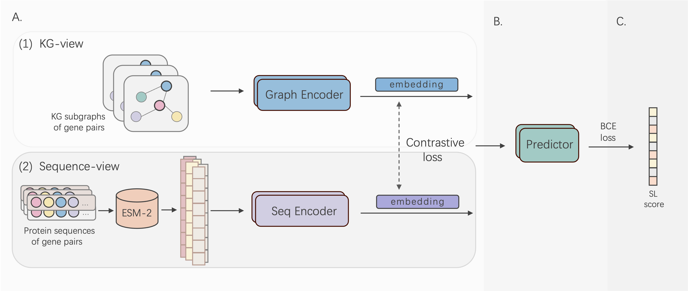

# MVCL4SL
MVCL4SL is a Multi-view Contrastive Learning model for prediction of cell line-specific synthetic lethality.

## Overview


## Requirements:
To run this project, the following packages are required:
```
dgl==2.2.1+cu118
memory_profiler==0.61.0
numpy==1.21.5
scikit_learn==1.0.2
torch==2.3.0
torchvision==0.18.1+cu118
torchvision==0.18.0
tqdm==4.64.1
```

## Running the code:
The following command runs the default script, which trains on the entire training set and tests in the scenario of N:1 n/p (the ratio of non-SLs to SLs) ratio in cell line HS936T, where N is the original n/p ratio in [SLKB](https://slkb.osubmi.org).

```
cd src 
sh run.sh
```